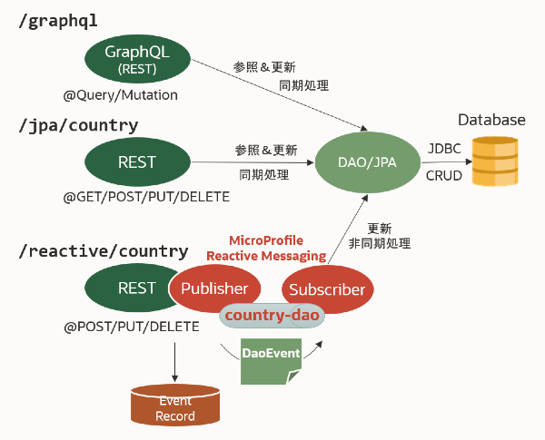

# [Helidon](https://helidon.io/) を使って [Eclipse MicroProfile](https://microprofile.io/) の仕様や拡張機能を確認するデモ

[OCHaCafe 2 - #4 Cloud Native時代のモダンJavaの世界](https://ochacafe.connpass.com/event/155389/) のために作成したデモですが、随時実装を追加しています。

## デモのソース

```text
src/main
├── java
│   └── oracle
│       └── demo
│           ├── package-info.java
│           ├── Main.java [起動クラス]
│           ├── App.java [JAX-RS Application]
│           ├── greeting [Helidon MP付属のサンプルコード]
│           │   ├── GreetingProvider.java
│           │   └── GreetResource.java
│           ├── echo [JAX-RS, CDI, JAX-P, JAX-B の基本]
│           │   └── EchoResource.java
│           ├── country [OpenAPI]
│           │   ├── CountryNotFoundExceptionMapper.java
│           │   └── CountryResource.java
│           ├── filter [JAX-RSのフィルター]
│           │   ├── Auth.java
│           │   ├── BasicAuthFilter.java
│           │   ├── CORSFilter.java
│           │   ├── CORS.java
│           │   ├── DebugFilter.java
│           │   └── Debug.java
│           ├── mapper [JAX-RSの例外マッパー]
│           │   └── CountryNotFoundExceptionMapper.java
│           ├── ft [フォルトトレランス]
│           │   ├── FaultToleranceResource.java
│           │   └── FaultToleranceTester.java
│           ├── health [ヘルスチェック]
│           │   ├── HealthCheckHelper.java
│           │   ├── HealthCheckResource.java
│           │   └── MyHealthCheck.java
│           ├── metrics [メトリクス]
│           │   └── MetricsResource.java
│           ├── restclient [RESTクライアント]
│           │   ├── Movie.java
│           │   ├── MovieReviewService.java
│           │   ├── MovieReviewServiceResource.java
│           │   ├── MovieReviewServiceRestClientResource.java
│           │   └── Review.java
│           ├── security [セキュリティ]
│           │   ├── IdcsResource.java
│           │   └── SecurityResource.java
│           ├── tracing [トレーシング]
│           │   ├── TracingResource.java
│           │   └── interceptor [SPAN定義 Interceptor & アノテーション]
│           │       ├── TraceInterceptor.java
│           │       ├── Trace.java
│           │       ├── TraceTagHolder.java
│           │       └── TraceTag.java
│           ├── reactive [Reactive Messaging & Connecter]
│           │   ├── DaoEvent.java
│           │   ├── ExecutorServiceHelper.java
│           │   ├── ReactiveJmsResource.java
│           │   └── ReactiveResource.java
│           ├── graphql [GraphQL]
│           │   ├── Country.java
│           │   └── CountryGraphQLApi.java
│           ├── jpa [拡張機能 JPA/JTA]
│           │   ├── CountryDAO.java
│           │   ├── Country.java
│           │   ├── CountryResource.java
│           │   ├── Greeting.java
│           │   └── JPAExampleResource.java
│           ├── grpc [拡張機能 gRPC]
│           │   ├── javaobj [gRPC Javaシリアライゼーション版]
│           │   │   ├── GreeterServiceImpl.java
│           │   │   ├── GreeterService.java
│           │   │   └── GrpcResource.java
│           │   └── protobuf [gRPC protobuf版]
│           │       ├── GreeterSimpleService.java
│           │       ├── GreeterService.java
│           │       ├── GrpcResource.java
│           │       └── helloworld
│           │           ├── GreeterGrpc.java
│           │           └── Helloworld.java
│           └── cowweb [おまけ]
│               └── CowwebResource.java
├── proto
│   └── helloworld.proto [gRPC IDL定義]
└── resources
    ├── application.yaml [Helidonの設定ファイル microprofile-config.properties 相当として利用可能]
    ├── createtable.ddl [JPA拡張機能で使うH2用のDDL]
    ├── jbossts-properties.xml [JTAの設定ファイル]
    ├── logging.properties [ログ設定ファイル]
    ├── META-INF
    │   ├── beans.xml [CDIの設定ファイル]
    │   ├── microprofile-config.properties [MicroProfile設定ファイル]
    │   ├── persistence.xml [JPAの設定ファイル]
    │   └── services
    │       └── io.helidon.microprofile.grpc.server.spi.GrpcMpExtension [gRPC Extension設定ファイル]
    └── WEB [静的コンテンツのフォルダー]
        └── index.html 
demo
├── k8s [kubernetesデプロイメント用マニフェスト]
│   ├── liveness-check.yaml
│   ├── open-tracing.yaml
│   ├── simple-deployment.yaml
│   └── simple-service.yaml
├── tracing [トレーシングデモ]
│   ├── request.json
│   └── tracing-demo.sh
└── weblogic [WebLogic Server コンテナ作成・設定]
    ├── config-jms.sh
    ├── config-jms.yaml
    ├── domain.properties
    └── start-weblogic.sh
```

## ビルド方法

```bash
# at first, generate java source files for gRPC by compiling proto file
mvn -P protoc generate-sources
# then create jar
mvn package
```

## アプリケーションの起動

```bash
java -jar target/helidon-demo-mp.jar
```

## ■ Docker イメージの作成

Dockerfileを使わずに、[Jib](https://github.com/GoogleContainerTools/jib) を使ってMavenから直接イメージをビルドします.  
ルートディレクトリにあるDockerfileを使ってもイメージの作成は可能です.

### 通常（ローカル）のタグを付与する場合

```bash
mvn post-integration-test # 便宜上post-integration-testにアサインしているだけ
```

### リモート用のタグを付与する場合

pom.xmlを以下のように設定し、
```xml
    <profiles>
        <!-- mvn -P could ... -->
        <profile>
            <id>cloud</id>
            <properties>
                <docker.repo.prefix>(remote docker repository path/)</docker.repo.prefix>
            </properties>
        </profile>
    </profiles>
```
以下を実行します.

```bash
mvn -P cloud post-integration-test
```

ローカルリポジトリに作成されたイメージをリポートリポジトリにpushします.

```bash
$ docker images
REPOSITORY                                        TAG                 IMAGE ID            CREATED             SIZE
helidon-demo-mp                                   2.0-SNAPSHOT        1b4d2e82f64a        49 years ago        125MB
helidon-demo-mp                                   latest              1b4d2e82f64a        49 years ago        125MB
(remote docker repository path/)helidon-demo-mp   2.0-SNAPSHOT        116de0207be6        49 years ago        125MB
(remote docker repository path/)helidon-demo-mp   latest              116de0207be6        49 years ago        125MB

$ docker push (remote docker repository path/)helidon-demo-mp
```

## ■ MicroProfile Health デモ (oracle.demo.health パッケージ)

`/health/live` (Liveness)、`/health/ready` (Readiness) 及び `/health` (複合パターン) のエンドポイントを使ってヘルスチェックができます。 

```json
{
    "outcome": "UP",
    "status": "UP",
    "checks": [
        {
            "name": "my-health-check-liveness",
            "state": "UP",
            "status": "UP",
            "data": {
                "time-to-fail": 0,
                "uptime": 29071
            }
        },
        {
            "name": "my-health-check-readiness",
            "state": "UP",
            "status": "UP"
        }
    ]
}
```

このデモでは、タイムアウト値を設定することによって、サーバーの起動時間が一定の値を超えるとLivenessをDOWNにすることができます。  
タイムアウト値(デフォルト= 0 [タイムアウトしない])は、2種類の方法で設定できます。

1. microprofile-config.properties (or application.yaml) で設定する

```text
# Health
#demo.healthcheck.liveness.name=_my-health-check
demo.healthcheck.time-to-fail=30 # in second, default: 0
```

2. RESTで設定する

```
$ curl localhost:8080/myhealth?timeToFail=30
```

## ■ gRPC 関連の補足 (oracle.demo.grpc パッケージ)

protobuf ペイロードを使ったサーバー実装は、POJO + Annotaion を使った方法と、GrpcMpExtensionを使って従来型のサービス実装クラスをデプロイする方法の、2種類を提供しています。おすすめは POJO + Annotaion です。

### POJO + Annotaion を使った方法（デフォルト 有効）

```text
oracle.demo.grpc.protobuf.GreeterSimpleService
```

### GrpcMpExtensionを使って従来型のサービス実装クラスをデプロイする方法

```text
oracle.demo.grpc.protobuf.GreeterService
oracle.demo.grpc.protobuf.GrpcExtension
META-INF/services/io.helidon.microprofile.grpc.server.spi.GrpcMpExtension
```

### 実装の切り替え方

1. META-INF/services/io.helidon.microprofile.grpc.server.spi.GrpcMpExtension を編集する
```text
# コメントアウトを外す
oracle.demo.grpc.protobuf.GrpcExtension
```

2. oracle.demo.grpc.protobuf.GreeterSimpleService を編集する
```java
// @Grpc アノテーションをコメントアウトする
// @Grpc(name = "helloworld.Greeter")
@ApplicationScoped
public class GreeterSimpleService{

    @Unary(name = "SayHello")
    public HelloReply sayHello(HelloRequest req) {
        System.out.println("gRPC GreeterSimpleService called - name: " + req.getName());
        return HelloReply.newBuilder().setMessage("Hello " + req.getName()).build();
    }
}
```

### gRPC - protoファイルのコンパイルについて

pom.xmlの通常ビルドフェーズとは独立してprotoファイルのコンパイルを行うプロファイルを定義しています。
以下のコマンドを使って、まず最初にソースを生成して、srcディレクトリにコピーをします。詳細は、pom.xml の内容を確認して下さい。

```bash
mvn -P protoc generate-sources
```

## ■ OpenTracing SPAN定義のためのアノテーション (oracle.demo.tracing.interceptor パッケージ)

MicroProfileのOpenTracingの実装の多くはSPANの定義を暗黙的に行っているケースが多く、コーディングしなくてもそれなりのトレース情報が出力されるので便利です。また、明示的にSPANを定義したい場合は@Tracedアノテーション(org.eclipse.microprofile.opentracing.Traced)を使って、メソッドにトレース出力をつけることができます。しかしながら、標準機能では必ずしも欲しい情報を出力してくれるとは限りません。そこで、ここではSPANの定義処理をCDI Interceptorとして実装して、Trace出力の内容をアノテーションである程度コントロールできるようにしてみました。

実装はoracle.demo.tracing.interceptor パッケージにあります。使用例はoracle.demo.jpa.CountryDAOを見て下さい。  
`/jpa/country?error=true` をGETすると以下のメソッドが呼ばれます。

```java
@Trace("JPA") 
@TraceTag(key = "JPQL", value = "select c from Countries c")
@TraceTag(key = "comment", value = "An error is expected by the wrong jpql statement.")
public List<Country> getCountriesWithError(){
    List<Country> countries = em.createQuery("select c from Countries c", Country.class).getResultList();
    return countries;
}
```

2つのアノテーションが利用可能です。

| annotation   | 説明 |
|--------------|------|
| @Trace       | 必須 ; SPANを定義するInterceptorを示す |
| @TraceTag    | オプション、key = キー, value = 値 ; SPAN内に定義するTagを追加する、複数使用可 |

@Trace の パラメータ

| parameter  | 説明 |
|------------|------|
| value      | defaul = "" ; SPAN名の接頭辞をつける、指定した場合 "<接頭辞>:<メソッド名>" となる|
| stackTrace | default = false ; Exception発生時にtrace logにstack traceを出力するか否か |

## ■ MicroProfile Reactive Messaging (oracle.demo.reactive パッケージ)

JPA/JDBC経由でデータベースにアクセスするデモ(oracle.demo.jpaパッケージ)のバリエーションとして、MicroProfile Reactive Messaging を使ったデータベースの非同期更新(Event Sourcing)処理を実装しています。RESTでリクエストを受け付けた後、非同期更新イベントを発行します。

```bash
# insert
curl -X POST -H "Content-Type: application/json" http://localhost:8080/reactive/country \
   -d '[{"countryId":86,"countryName":"China"}]'
curl http://localhost:8080/jpa/country/86 # {"countryId":86,"countryName":"China"}

# update
curl -X PUT -H "Content-Type: application/x-www-form-urlencoded" http://localhost:8080/reactive/country/86 \
  -d "name=People's Republic of China"
curl http://localhost:8080/jpa/country/86 # {"countryId":86,"countryName":"People's Republic of China"}

# delete
curl -X DELETE http://localhost:8080/reactive/country/86
curl -v http://localhost:8080/jpa/country/86 # 404 Not Found
```

### JMS Connector

更に、Helidonが提供している JMS Connectorを使って WebLogic Server の JMSキューを経由したデータベースの非同期更新(Event Sourcing)処理を実装しています。このデモの実行にはWebLogic Serverのクライアント・ライブラリが必要なので、デフォルトで無効にしています。

```bash
# insert
curl -X POST -H "Content-Type: application/json" http://localhost:8080/reactive/jms/country \
   -d '[{"countryId":61,"countryName":"Australia"}]'
curl http://localhost:8080/jpa/country/61 # {"countryId":61,"countryName":"Australia"}

# update
curl -X PUT -H "Content-Type: application/x-www-form-urlencoded" http://localhost:8080/reactive/jms/country/61 \
  -d "name=Commonwealth of Australia"
curl http://localhost:8080/jpa/country/61 # {"countryId":61,"countryName":"Commonwealth of Australia"}

# delete
curl -X DELETE http://localhost:8080/reactive/jms/country/61
curl -v http://localhost:8080/jpa/country/61 # 404 Not Found
```

### JMS Connector デモを有効化するには

1. WebLogic Server をインストールし、JMSリソースを構成する  
適当なキューを定義して下さい

2. Mavenのローカル・リポジトリを作成して、WebLogic Serverのクライアント・ライブラリ(wlthint3client.jar)をデプロイする  
クライアント・ライブラリはパブリックMavenリポジトリからは入手できませんので、ローカル・リポジトリをマニュアルで作成します。
`create-local-repo.sh` を編集してこのシェルを実行してください。`m2repo`フォルダにjarファイルがデプロイされます。  
wlthint3client.jar は後述するWebLogic Serverのコンテナ・イメージから入手するのが簡単かもしれません。

```bash
WL_HOME=${HOME}/opt/wls1411
WL_T3CLIENT_JAR=${WL_HOME}/wlserver/server/lib/wlthint3client.jar # これを正しいパスに

mkdir -p m2repo

mvn deploy:deploy-file \
 -Dfile=$WL_T3CLIENT_JAR \
 -Durl=file:./m2repo \
 -DgroupId=oracle.weblogic \
 -DartifactId=wlthint3client \
 -Dversion=14.1.1.0.0 \
 -Dpackaging=jar \
 -DgeneratePom=true
```
3. pom.xml 及び Javaソースのコメントアウトを外す
 - pom.xml
```xml
        <!-- WebLogic thin t3 client for 14.1.1 -->
        <!--
        <dependency>
            <groupId>oracle.weblogic</groupId>
            <artifactId>wlthint3client</artifactId>
            <version>14.1.1.0.0</version>
        </dependency>
        -->
```
 - src/main/java/oracle/demo/reactive/ReactiveJmsResource.java
```java
    //@Outgoing("to-jms")
    public Publisher<Message<String>> preparePublisher() {
        return ReactiveStreams.fromPublisher(FlowAdapters.toPublisher(publisher)).buildRs();
    }

    //@Incoming("from-jms")
    @Acknowledgment(Acknowledgment.Strategy.MANUAL)
    public CompletionStage<?> consume(Message<String> message) {
```

 - src/test/java/oracle/demo/reactive/ReactiveJmsResourceTest.java
```java
//@HelidonTest
public class ReactiveJmsResourceTest{

    @Inject private WebTarget webTarget;

    //@Test
    public void testCRUDCountry(){
```
4. src/main/resources/application.yaml を編集して、WebLogic Serverの接続設定を行う

```yaml
# Reactive Messaging
mp.messaging:

  incoming.from-jms:
    connector: helidon-jms
    destination: ./SystemModule-0!Queue-0 # 確認
    type: queue

  outgoing.to-jms:
    connector: helidon-jms
    destination: ./SystemModule-0!Queue-0 # 確認
    type: queue

  connector:
    helidon-jms:
      user: weblogic # 確認
      password: Ochacafe00 # 確認
      jndi:
        jms-factory: weblogic.jms.ConnectionFactory
        env-properties:
          java.naming:
            factory.initial: weblogic.jndi.WLInitialContextFactory
            provider.url: t3://localhost:7001 # 確認
```

### テスト用の WebLogic Server Docker インスタンスの作成 

JMS Connector のテストに使うための設定済み WebLogic Server インスタンスを Docker コンテナで実行するためのスクリプトを用意しています。

0. (必要に応じて) Oracle コンテナ・レジストリへのログイン  
事前に `docker login container-registry.oracle.com` を済ませておいて下さい。

1. demo/weblogic/start-weblogic.sh の実行  
WebLogic Server の公式コンテナ・イメージを取得して起動します。  
 `docker logs`を確認してサーバーが起動するまで待機して下さい。`<Server state changed to RUNNING.>` が表示されたらOKです。

```
$ docker logs --tail 3 wls1411
<Jan 6, 2021, 3:29:24,496 PM Greenwich Mean Time> <Notice> <WebLogicServer> <BEA-000331> <Started the WebLogic Server Administration Server "AdminServer" for domain "base_domain" running in development mode.> 
<Jan 6, 2021, 3:29:24,611 PM Greenwich Mean Time> <Notice> <WebLogicServer> <BEA-000360> <The server started in RUNNING mode.> 
<Jan 6, 2021, 3:29:24,651 PM Greenwich Mean Time> <Notice> <WebLogicServer> <BEA-000365> <Server state changed to RUNNING.> 
```

2. demo/weblogic/config-jms.sh の実行  
WebLogic Server Deploy Tooling を使ってJMSリソースを追加し、サーバーを再起動します。

尚、デモの実行に必要な wlthint3client.jar は、以下のようにコンテナから取得することが可能です。

```bash
docker cp wls1411:/u01/oracle/wlserver/server/lib/wlthint3client.jar wlthint3client.jar
```

## ■ MicroProfile GraphQL (oracle.demo.graphql パッケージ)

JPA経由でデータベースのCRUD操作をRestで公開するコードは既に提供していましたが、これをMicroProfile GraphQL仕様にしたものを追加しました。  
スキーマは `/graphql/schema.graphql` から取得できます。


```text
type Country {
  countryId: Int!
  countryName: String!
}

type Mutation {
  deleteCountry(countryId: Int!): Int!
  insertCountries(countries: [CountryInput]): [Country]
  insertCountry(country: CountryInput): Country
  updateCountry(countryId: Int!, countryName: String): Country
}

type Query {
  countries: [Country]
  country(countryId: Int!): Country
}

input CountryInput {
  countryId: Int!
  countryName: String!
}
```

curlでテストする場合は、以下を参考にして下さい。  
同様の操作は、GrapghQLのテストケース(CountryGraphQLApiTest.java)でも行っていますので、そちらも参考にしてください。

```bash
# query: countries: [Country]
curl -X POST -H "Content-Type: application/json" localhost:8080/graphql \
  -d '{ "query" : "query { countries { countryId countryName } }" }'

# query: country(countryId: Int!): Country
curl -X POST -H "Content-Type: application/json" localhost:8080/graphql \
  -d '{ "query" : "query { country(countryId: 1) { countryName } }" }'

# mutation: insertCountry(country: CountryInput): Country
curl -X POST -H "Content-Type: application/json" localhost:8080/graphql \
  -d '{ "query" : "mutation { insertCountry (country:{countryId:86,countryName:\"China\"}) { countryId countryName } }" }'

# mutation: insertCountries(countries: [CountryInput]): [Country]
curl -X POST -H "Content-Type: application/json" localhost:8080/graphql \
  -d '{ "query" : "mutation { insertCountries (countries:[{countryId:82,countryName:\"Korea\"},{countryId:91,countryName:\"India\"}]) { countryId countryName } }" }'

# mutation: updateCountry(countryId: Int!, countryName: String): Country
curl -X POST -H "Content-Type: application/json" localhost:8080/graphql \
  -d '{ "query" : "mutation { updateCountry (countryId:1,countryName:\"United States\") { countryId countryName } }" }'

# mutation: deleteCountry(countryId: Int!): Int!
curl -X POST -H "Content-Type: application/json" localhost:8080/graphql \
  -d '{ "query" : "mutation { deleteCountry (countryId:86) }" }'
```

結果、JDBC/JPAを使ったデータベースへのアクセスは、以下のバリエーションを実装しています。
+ REST経由の同期参照＆更新処理
+ REST経由 MicroProfile Reactive Messaging を使った非同期更新(Event Sourcing)処理
+ MicroProfile GraphQL を使った Query & Mutation 処理 



## ■ （おまけ）Cowsay (oracle.demo.cowweb パッケージ)

https://github.com/ricksbrown/cowsay

```
$ curl localhost:8080/cowsay/say
 ______
< Moo! >
 ------
        \   ^__^
         \  (oo)\_______
            (__)\       )\/\
                ||----w |
                ||     ||

$ curl "localhost:8080/cowsay/think?message=Hello&cowfile=moose"
 _______
( Hello )
 -------
  o
   o   \_\_    _/_/
    o      \__/
           (oo)\_______
           (__)\       )\/\
               ||----w |
               ||     ||

```
エンジョイ！

---
_Copyright © 2019-2021, Oracle and/or its affiliates. All rights reserved._


